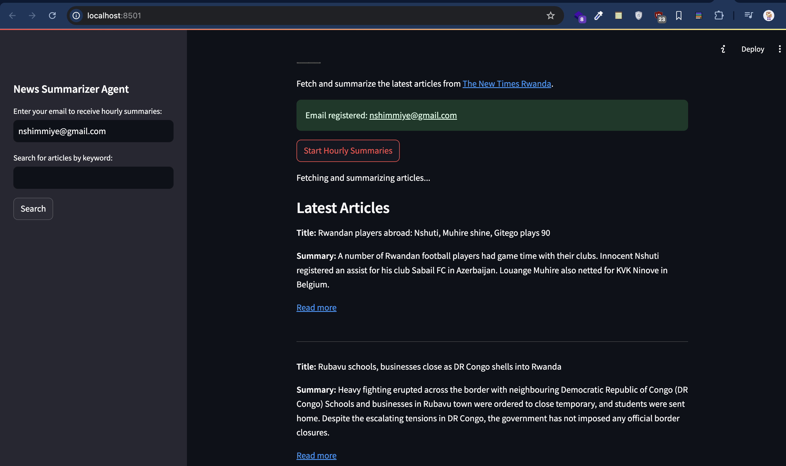
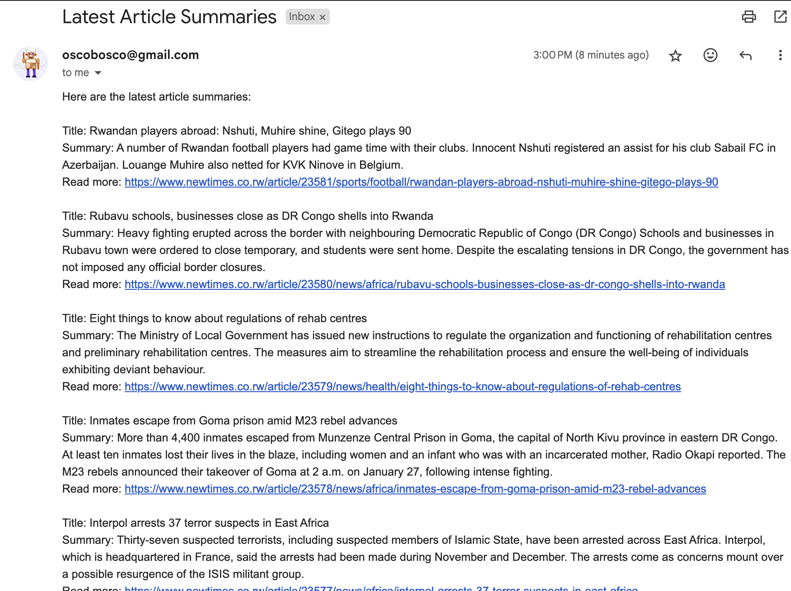

# summarized news web application and Agent AI
is AI-driven web application, that summarize the latest 5 articles from newtimes.co.rw, by webscrapping  them with beautifulSoup and then summarize every returned article up to 5 and display in browser with react.js and/or prefer to send the summarized articles to prefered email.

### components
- django
- react.js
- huggingface
- material UI
- SMTP

NB: they run locally
#### run the Backend side
 
``` <python>
cd api/
pip install requirements.txt
python manage.py runserver
```

You can use postman to check the output before heading to front End

#### run the FrontEnd side
``` <react.js>
cd ../
npm install
npm start

```

#### run the Agent AI
``` 
cd agent-ai/
streamlit run app.py

```





You can read more of by following this [link](https://dev.to/sababu_/ai-from-home-to-new-home-36kk-temp-slug-2894209?preview=a9f37259d63215e9d5c47fecbaee24712c1baa2e3b4130c84e2b1e9e900601e100e43705d159e79f9414fb7e7f8a6f4d3bd218c4fb165050b2069f99), I explain the reason why I decided to work on this project.